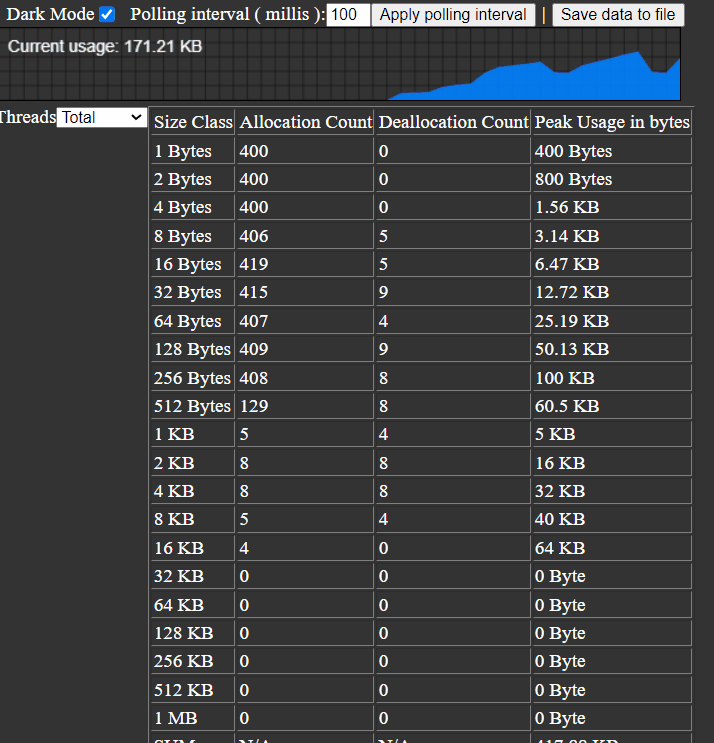

## <a name="intro"></a>**memlive**  

Memlive is a live per-thread allocation profiler for Linux and Windows. After building your application with it, you can monitor allocations in your browser : 



In order to use it :

```cpp
//#define MEMLIVE_MAX_SIZE_CLASS_COUNT 21 // 21 is the default in memlive.h so it will captures allocs up to 2^(21-1)/1 mb,  increase it if you need more
#include "memlive.h"
using namespace memlive;
...				
memlive_start(address, port_number);
```

( On Windows, make sure that memlive.h is included before windows.h inclusion. That is due to a conflict between ws2tcpip.h and windows.h. )

After that you navigate to address:port_number in your browser. You can check "memlive example" in the examples directory.

- You can adjust the max allocation size to capture by defining MEMLIVE_MAX_SIZE_CLASS_COUNT before including memlive.h. If not defined it will be defaulted to 21 which will capture allocations up to 1MB.

- In order to view total peak size, select "Total" in the left hand side drop down list. Overall peak usage will appear in the most bottom row.

- In order to minimise the load , you can change the polling interval ( Ajax polling between html/js and cpp side ) in your browser.

- It uses one reactor thread which does async IO. That thread's stats are excluded, therefore all stats you will see will belong only to your application.

- In case you want to capture stats for only a sub part of your software, you can call memlive::reset just before the start of the sub part.

- The embedded Javascript code has no external dependencies. Therefore you don't need internet connection to make it work.

You can also use it for other custom allocators :

```cpp
#define MEMLIVE_DISABLE_REDIRECTIONS // Memlive will not redirect standard allocation and deallocation functions 

void* your_custom_allocate_function(std::size_t size)
{
    ...
    memlive::capture_custom_allocation( ptr, size);
    ...
    return ptr;
}

void your_custom_deallocate_function(void* ptr)
{
    ...
    memlive::capture_custom_deallocation( ptr);
    ...
}

```